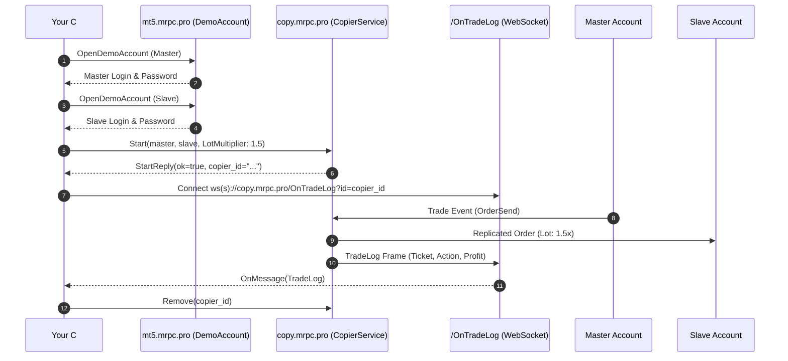

# Quick Start: Your First Project in 10 Minutes

This step-by-step tutorial walks you through building a complete trade replication application in **C#** from scratch using **CSharpCopier**.

---

## 1. Overview of Steps

In this guide you will:
1. **Provision two demo MetaTrader accounts** via gRPC (`DemoAccount.OpenDemoAccount`).
2. **Connect to MetaRPC Trade Copier** over HTTP/2 gRPC (`copy.mrpc.pro:443`).
3. **Start an active copier** configured with risk multipliers and SL/TP synchronization.
4. **List all registered copiers** and inspect their state.
5. **Stream real-time trade logs** via WebSocket (`/OnTradeLog?id={copierId}`).
6. **Pause and remove** the copier cleanly.

---

## 2. Complete Runnable Code

```csharp
using System;
using System.Threading.Tasks;
using MetaRPC.Copier;
using MetaRPC.Copier.Models;

// 1. Provision Demo Accounts via gRPC
var demoClient = new DemoAccountClient("https://mt5.mrpc.pro:443");
var masterAcc = await demoClient.OpenDemoAccountAsync(new GuiDemoOpenAccountRequest
{
    Company = "MetaQuotes Software Corp.",
    FirstName = "Master",
    LastName = "Trader",
    Email = "master@example.com",
    Server = "MetaQuotes-Demo"
});
Console.WriteLine($"Master Demo Account: {masterAcc.Login}");

var slaveAcc = await demoClient.OpenDemoAccountAsync(new GuiDemoOpenAccountRequest
{
    Company = "MetaQuotes Software Corp.",
    FirstName = "Slave",
    LastName = "Follower",
    Email = "slave@example.com",
    Server = "MetaQuotes-Demo"
});
Console.WriteLine($"Slave Demo Account: {slaveAcc.Login}");

// 2. Connect to Copier Service
var copier = new CopierService("https://copy.mrpc.pro:443", userKey: "YOUR_USER_KEY");

// 3. Start Copier with Risk Multiplier
var startReply = await copier.StartAsync(new StartRequest
{
    UserKey = "YOUR_USER_KEY",
    Master = new Account { Type = "MT5", User = masterAcc.Login, Password = masterAcc.Password, Server = masterAcc.Server },
    Slave = new Account { Type = "MT5", User = slaveAcc.Login, Password = slaveAcc.Password, Server = slaveAcc.Server },
    RiskType = "LotMultiplier",
    RiskValue = "1.5",
    CopySl = true,
    CopyTp = true,
    CopyPendingOrders = true,
    ReverseCopy = false
});
Console.WriteLine($"Copier started! ID: {startReply.CopierId}");

// 4. List Copiers
var list = await copier.ListAsync();
foreach (var c in list.Copiers)
    Console.WriteLine($"Active Copier: {c.Id} [{c.MasterUser} -> {c.SlaveUser}] Paused: {c.Paused}");

// 5. Stream Trade Logs via WebSocket
using var ws = copier.StreamTradeLogs(startReply.CopierId, log => {
    Console.WriteLine($"[TRADE LOG] Ticket: {log.SlaveTicket} Action: {log.UpdateType} Profit: {log.Profit}");
});

// 6. Pause and Cleanup
await Task.Delay(5000);
await copier.PauseAsync(startReply.CopierId, paused: true);
await copier.RemoveAsync(startReply.CopierId);
Console.WriteLine("Copier cleanly removed.");
```

---

## 3. How It Works Under the Hood


